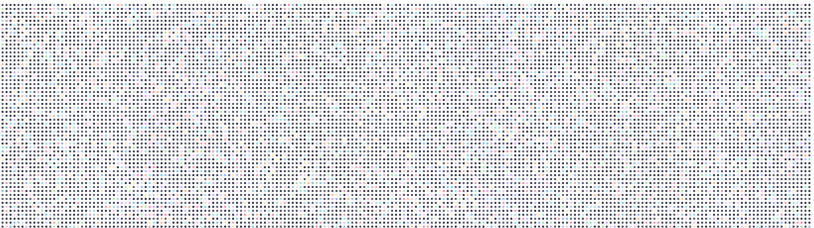

# Wallpaper

Generates wallpapers that look like a grid of squares with rounded corners and margin that fill your whole screen, mostly dark some color.

Python command to generate any resolution needed. 

